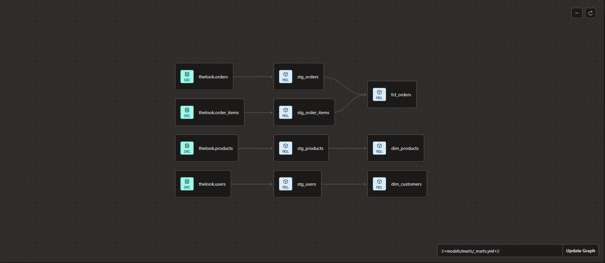

# E-Commerce Analytics — dbt + BigQuery

A dbt project that transforms raw e-commerce data into a clean, **tested**, dimensional model that answers real business questions. Built on a cloud data warehouse, version-controlled in git, and documented with a dependency-aware lineage graph.

**Author:** Muhammad Shafiq Azhar · [github.com/shafiqazhar89](https://github.com/shafiqazhar89)

---

## What this project does

Raw e-commerce tables are messy and built for transactions, not analysis. This project takes them through a layered dbt pipeline — light cleaning in a staging layer, then a star-schema dimensional model in a marts layer — so an analyst can answer business questions directly, with confidence that the data has passed automated quality checks on every build.

The data is the public **`thelook_ecommerce`** synthetic dataset shipped with BigQuery (`orders`, `order_items`, `users`, `products`).

## Business questions it answers

The model is designed to answer questions an analyst actually gets asked:

1. **Monthly revenue and order-volume trend** — how are sales growing over time?
2. **Top product categories by revenue** — where does the money come from?
3. **Delivery time vs. order outcome** — how long does fulfilment take, and how does it relate to order status?
4. **Repeat-customer rate** — how many customers come back versus buy once?
5. **Revenue by country / region** — where are our customers?

## Architecture

```
raw (BigQuery public data)
      │
      ▼
staging/   stg_*   → clean, rename, cast types · 1:1 with source · materialized as views
      │
      ▼
marts/     dim_* and fct_*   → the dimensional model · materialized as tables
      │
      ▼
business questions answered
```

**Lineage graph** (generated by dbt from `source()` and `ref()` dependencies):



<!-- Save your lineage screenshot as docs/lineage_graph.png in the repo, or update the path above. -->

## The models

**Staging** (`models/staging/` — views, one per source table):
- `stg_orders` — order-level records, renamed and cast
- `stg_order_items` — line-item records (keys + `sale_price`)
- `stg_users` — customer attributes (PII such as email deliberately excluded)
- `stg_products` — product attributes and prices

**Marts** (`models/marts/` — tables, the dimensional model):
- `dim_customers` — one row per customer
- `dim_products` — one row per product
- `fct_orders` — **the central fact table: one row per order**, with revenue, line count, delivery time, and status. Line items are aggregated to order grain in a CTE, then joined one-to-one to the order spine with a `left join` so no order is ever silently dropped.

## Data quality

Nine tests run on every build, across four test types — a focused suite that proves the model's integrity rather than padding the count:

- **`unique` + `not_null`** on every primary key (`order_id`, `customer_id`, `product_id`) — enforces the grain automatically.
- **`relationships`** from `fct_orders.customer_id` → `dim_customers.customer_id` — enforces referential integrity between fact and dimension.
- **`accepted_values`** on `order_status` — fails the build if an unexpected status ever appears.

## Stack

- **dbt** (Fusion engine, browser IDE) — modelling, testing, documentation
- **BigQuery** — cloud data warehouse
- **git / GitHub** — version control

## How to run

```bash
dbt run     # build the staging views and mart tables
dbt test    # run all data-quality tests
```

## What I'd add next

- **Incremental models** on `fct_orders` so large fact tables rebuild only new rows
- **Snapshots** to track slowly-changing dimensions (e.g. a customer's country over time)
- **CI with GitHub Actions** — run `dbt build` automatically on every pull request
- **Additional marts** — a line-item-grain fact (`fct_order_items`) and further dimensions
